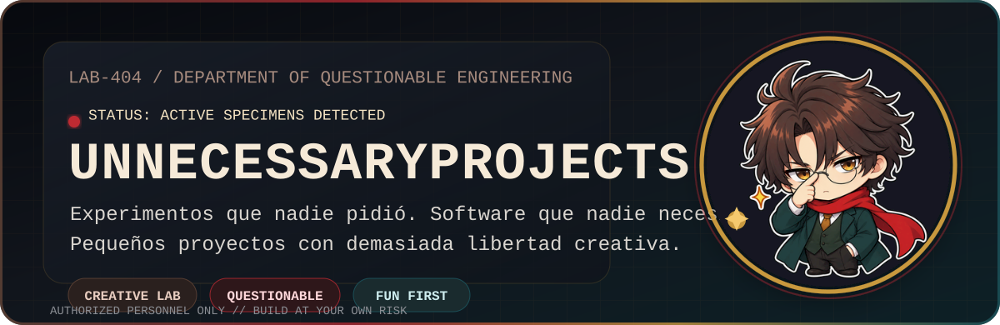
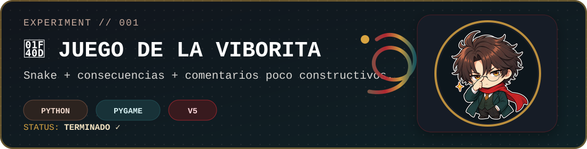
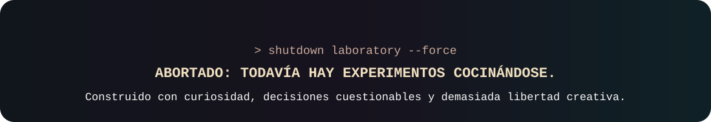

<div align="center">

<picture>
  <source media="(prefers-color-scheme: dark)" srcset="./assets/hero-dark.svg">
  <source media="(prefers-color-scheme: light)" srcset="./assets/hero-light.svg">
  
</picture>

<br><br>


<br><br>

**Una colección de proyectos innecesarios, cuestionables y ocasionalmente malditos.**

*Nadie los pidió. Nadie los necesitaba. Los hice de todos modos.*

</div>

---

## ⚠️ Aviso del laboratorio

> [!WARNING]
> **Este repositorio contiene ingeniería cuestionable.**  
> Algunos proyectos pueden no resolver absolutamente ningún problema real.  
> Eso no significa que no deban existir.

---

## 🔬 Base de datos de experimentos

<div align="center">

<a href="./001-shrinking-snake">
  
</a>

</div>

### 🐍 001 — Juego de la viborita

El clásico Snake, excepto que aquí **perder tiene consecuencias**.

Cada derrota reduce el área jugable, la ventana se hace más pequeña y el juego aprovecha para recordarte —con muy poca delicadeza— que acabas de fallar.

**Versión actual:** `V5` · **Estado:** ✅ Terminado · **Tecnología:** Python / Pygame

> Cuanto más fallas, menos espacio tienes.  
> Snake normal no era suficientemente estresante.

---

## 🔒 Próximos experimentos

```text
ID    EXPERIMENTO                  ESTADO
──────────────────────────────────────────────────
001   Juego de la viborita         CONTENIDO ✓
002   ████████████████████         CLASIFICADO
003   ████████████████████         ESPERANDO MALA IDEA
004   ████████████████████         NO AUTORIZADO
```

> [!NOTE]
> El laboratorio no mantiene roadmap.  
> Las malas ideas aparecen cuando quieren.

---

## 🤨 ¿Qué es esto?

`UnnecessaryProjects` es mi pequeño laboratorio para crear cosas raras, divertidas, experimentales y completamente innecesarias.

Aquí puede aparecer un juego, una herramienta, una automatización, algo de hardware, una aplicación absurdamente específica o cualquier cosa que haya nacido de una frase peligrosa:

> **“¿Y si programamos esto?”**

No existe un lenguaje, framework, plataforma o tecnología fija.

La única regla realmente importante es:

> ### **Que haya sido divertido construirlo.**

---

<details>
<summary><b>📁 Estructura del laboratorio</b></summary>

<br>

Cada experimento vive dentro de su propia carpeta:

```text
UnnecessaryProjects/
│
├── 001-shrinking-snake/
│   ├── README.md
│   └── ...
│
├── assets/
│   ├── hero-dark.svg
│   ├── hero-light.svg
│   ├── experiment-001.svg
│   ├── footer.svg
│   └── chibi-prince.png
│
├── 002-???
├── 003-???
└── README.md
```

Cada proyecto puede utilizar tecnologías completamente diferentes.

</details>

<details>
<summary><b>🛠️ Tecnologías potencialmente peligrosas</b></summary>

<br>

El laboratorio no tiene un stack fijo.

Actualmente se ha detectado:

- 🐍 Python
- 🎮 Pygame

Y en futuros incidentes podrían aparecer:

- JavaScript / TypeScript
- C / C++
- Rust
- Desarrollo web
- Aplicaciones de escritorio
- Automatización
- Inteligencia Artificial
- APIs
- Hardware
- cualquier otra tecnología que parezca una buena —o terrible— idea

</details>

---

## 🎥 La serie

Muchos de estos proyectos forman parte de una serie de pequeños experimentos de programación.

La intención no es necesariamente construir algo útil. La idea es tomar algo relativamente sencillo y hacerme una pregunta que rara vez termina bien:

> **“¿Cómo puedo hacer esto innecesariamente interesante?”**

Cada proyecto es una nueva excusa para experimentar, aprender y construir algo que probablemente nadie había pedido.

---

<div align="center">



</div>
